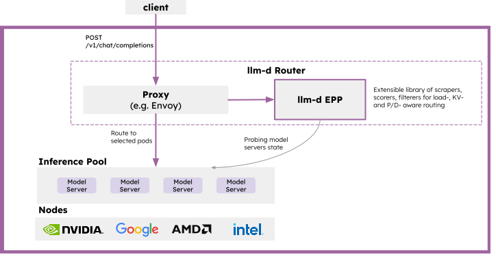

# Architecture

High-level guide to llm-d architecture. Start here, then dive into specific guides.

## Core Components

The llm-d architecture is built around three primary concepts: the Router, the InferencePool, and the Model Server.

- **llm-d Router** - The intelligent entry point for inference requests. It provides LLM-aware load balancing, request queuing, and policy enforcement. It is composed of two functional parts:
    - **Proxy**: A high-performance L7 proxy (typically Envoy) that accepts user requests and consults the EPP via the `ext-proc` protocol to determine the optimal destination.
    - **Endpoint Picker (EPP)**: The routing engine that scores and selects model server pods based on real-time metrics, KV-cache affinity, and configured policies.

- **InferencePool** - The API that defines a group of Model Server Pods sharing the same model and compute configuration. Conceptualized as an "LLM-optimized Service", it serves as the discovery target for the Router.

- **Model Server** - The inference engine (such as vLLM or SGLang) that executes the model on hardware accelerators (GPUs, TPUs, HPUs).

  

For more details on the core components, see:
- [llm-d Router](core/router/README.md)
    - [Proxy](core/router/proxy.md)
    - [EPP](core/router/epp/README.md)
- [InferencePool](core/inferencepool.md)
- [Model Server](core/model-servers.md)

## Advanced Patterns

llm-d's core design can be extended with optional advanced patterns:

### Disaggregated Serving

In disaggregated serving, a single inference request is split into multiple phases (e.g., Prefill and Decode) handled by specialized workers. The llm-d Router orchestrates this flow by selecting both a prefill and a decode endpoint and coordinating the KV-cache transfer between them.

See [Disaggregation](advanced/disaggregation/README.md) for complete details.

### Router "Consultants"

The EPP can be extended with 'consultant' sidecars that provide additional signals for routing decisions:
- [Latency Predictor](advanced/latency-predictor.md): Trains an XGBoost model online to predict request latency for better endpoint scoring.
- [KV-Cache Indexer](advanced/kv-indexer.md): Maintains a precise, event-driven view of KV cache state across all model servers for high-affinity routing.

### Autoscaling

llm-d supports proactive, SLO-aware autoscaling through two complementary approaches:
- **HPA/KEDA**: Standard Kubernetes-native scaling using metrics exported by the EPP (like queue depth).
- **Workload Variant Autoscaler (WVA)**: Globally optimized scaling that minimizes cost by routing traffic across different model variants (e.g., different hardware or quantization) while meeting latency targets.

See [Autoscaling](advanced/autoscaling/README.md) for complete details.
