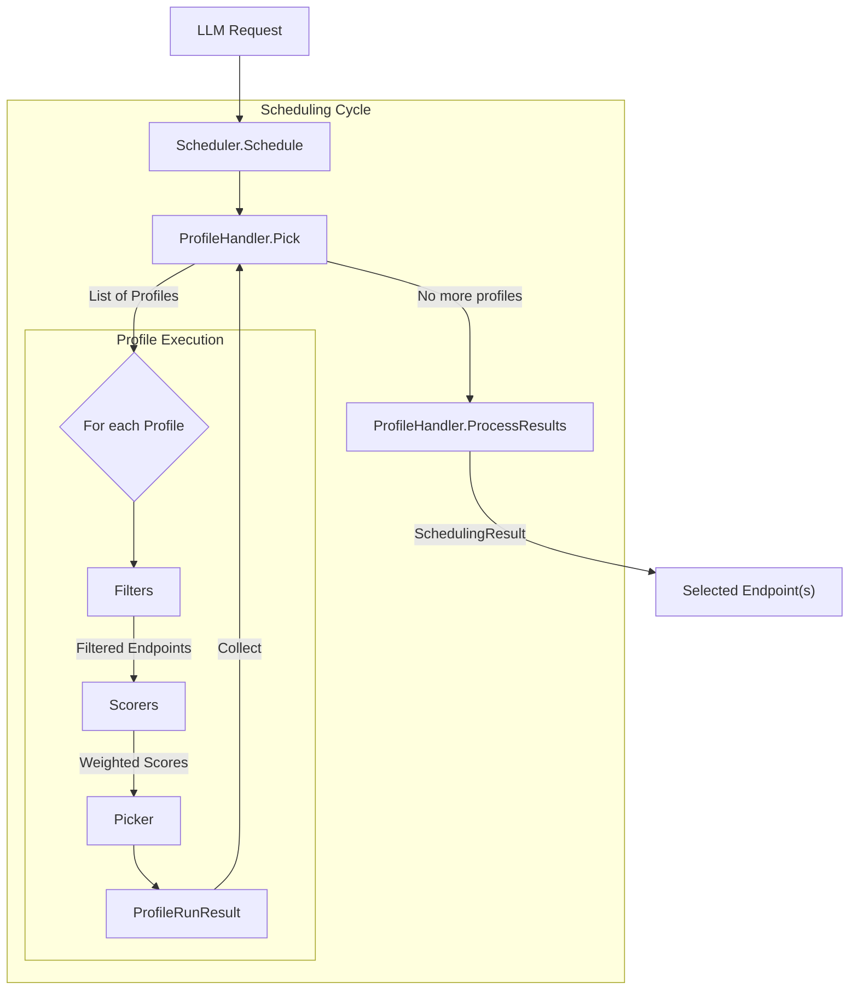

# EPP Scheduler

The EPP Scheduler is a highly modular and extensible component within the Endpoint Picker (EPP) designed to select the optimal model server (endpoint) for an LLM request. It leverages a plugin-based architecture, allowing for sophisticated scheduling strategies based on real-time metrics, prefix caching, and model-specific requirements like LoRA adapters.

## Architecture Overview

The scheduler follows a **Filter -> Score -> Pick** lifecycle for every request. It orchestrates multiple **SchedulerProfiles**, each defining a specific set of plugins for filtering and scoring candidate endpoints.

### Core Components

*   **Scheduler**: The main orchestrator that manages the scheduling cycle. It invokes `ProfileHandler` to pick profiles and then runs the selected profiles to obtain target endpoints.
*   **InferenceRequest**: A structured internal representation of the incoming request, including the target model, parsed body (Completions, ChatCompletions, etc.), headers, and objectives.
*   **Endpoint**: Represents a candidate serving engine, with its metadata (e.g., Pod name, namespace and port) and state (e.g., active models, queue depth and KV-cache). Note that a Pod may run one or more endpoints each on a differen port, this is case in [the data parallel deployment mode](https://docs.vllm.ai/en/latest/serving/data_parallel_deployment/).

### Extension Points

The scheduler's logic is distributed across several extension points, implemented via plugin interfaces:

1.  **ProfilePicker**: (Implemented by `ProfileHandler`) Selects which `SchedulerProfile`s to run based on the request and previous cycle results.
2.  **Filter**: Narrows down the list of candidate endpoints (e.g., based on health, SLO headroom, or cache affinity).
3.  **Scorer**: Assigns a score between `0.0` and `1.0` to each filtered endpoint. Multiple scorers can be weighted and combined.
4.  **Picker**: Selects the final endpoint(s) from the scored list (e.g., highest score, weighted random).
5.  **ProcessResults**: (Implemented by `ProfileHandler`) Aggregates the results from all executed profiles to produce the final `SchedulingResult`.

### Scheduler Profile

A `SchedulerProfile` is a configured pipeline consisting of:
*   **Filters**: A list of `Filter` plugins run sequentially.
*   **Scorers**: A list of `WeightedScorer` objects, where each contains a `Scorer` plugin and its relative weight.
*   **Picker**: A single `Picker` plugin that makes the final selection.

When a profile runs, it first filters the candidate endpoints. If any remain, it calculates a weighted aggregate score for each and then passes the scored list to the picker. The final score for an endpoint is calculated by multiplying the score returned by each scorer (which is bounded between 0.0 and 1.0) by its configured weight, and summing these weighted scores together. For example, if Scorer A (weight 2.0) returns 0.8 and Scorer B (weight 1.0) returns 0.5, the endpoint's final score is `(0.8 * 2.0) + (0.5 * 1.0) = 2.1`.

---

## Concrete Plugins

*Note: Not all of the plugins listed below are configured by default. Only a curated subset is enabled out-of-the-box. For the current default scheduling configuration, see [Default Configuration Placeholder Link](placeholder).*
### Filters
*   **[`prefix-cache-affinity-filter`](placeholder-link)**: A probabilistic filter that narrows candidates to "sticky" endpoints (those with high prefix cache scores). It includes a "TTFT load gate" to break stickiness if sticky endpoints are significantly slower than non-sticky ones.
*   **[`slo-headroom-tier-filter`](placeholder-link)**: Filters endpoints based on SLO headroom tiers to ensure quality of service.

### Scorers

*For details on exactly how each scorer calculates its score (0.0 to 1.0), please refer to the specific plugin's documentation.*

*   **[`kv-cache-utilization-scorer`](placeholder-link)**: Prefers endpoints with lower KV cache utilization to avoid fragmentation.
*   **[`latency-scorer`](placeholder-link)**: Scores endpoints based on predicted latency headroom, defined as the gap between the predicted request latency and the user's SLO if set.
*   **[`lora-affinity-scorer`](placeholder-link)**: Prefers endpoints that already have the requested LoRA adapter active or have capacity to load it.
*   **[`prefix-scorer`](placeholder-link)**: Scores based on the length of the prefix cache match.
*   **[`queue-depth-scorer`](placeholder-link)**: Prefers endpoints with shorter request queues.
*   **[`running-requests-scorer`](placeholder-link)**: Scores based on the number of currently active requests.
*   **[`token-load-scorer`](placeholder-link)**: Scores based on the total token load (input + output) handled by the endpoint.

### Pickers
*   **[`max-score-picker`](placeholder-link)**: Selects the endpoint with the absolute highest score.
*   **[`random-picker`](placeholder-link)**: Selects an endpoint randomly from the candidates.
*   **[`weighted-random-picker`](placeholder-link)**: Selects an endpoint randomly, using the scores as relative probabilities (lottery scheduling).

### Profile Handlers
*   **[`single-profile-handler`](placeholder-link)**: A standard implementation that runs a single configured primary profile.

---

## Advanced Use Cases: Prefill/Decode Disaggregation

The scheduler natively supports advanced routing paradigms, such as **Prefill/Decode Disaggregation (P/D Disagg)**. This is a serving technique where the initial prompt processing (prefill) and the subsequent token generation (decode) are handled by separate, specialized model servers.

In a P/D Disagg setup, the `ProfileHandler` orchestrates two separate `SchedulerProfiles`:
1.  **Prefill Profile**: Evaluates and scores endpoints specialized for compute-heavy prompt processing. It may use filters and scorers focused on prefix cache affinity, queue depth, or token load.
2.  **Decode Profile**: Evaluates and scores endpoints specialized for memory-bandwidth-bound token generation.

The `ProfileHandler` uses the `Pick` extension point to determine which profiles need to run for a given request (e.g., if a request needs both prefill and decode, or just decode if the KV cache is already transferred). The prefill and decode endpoints are picked at the same time. The `ProfileHandler` then uses the `ProcessResults` extension point to aggregate the selected endpoints. The decode endpoint is the one that will be returned to the proxy to forward the request to, while the prefill endpoint is added as a header that the decode sidecar uses to perform remote prefill.

